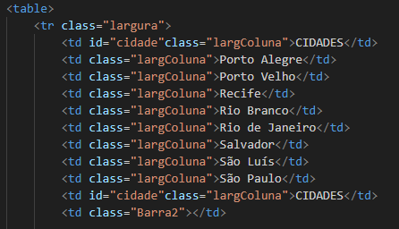
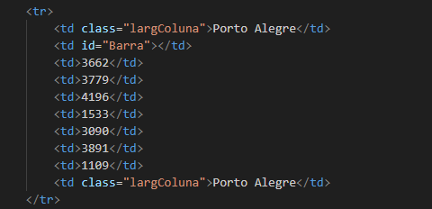
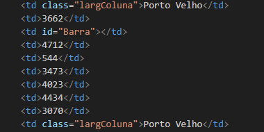

# Projeto - Tabela - Distancia
 
Projeto criado como parte avaliativa da disciplina de Fundamentos de Desenvolvimento ministrada pelo professor Leonardo Rocha.
 
## Índice
* [Descriçaõ](#descrição)
* [Tecnologias](#tecnologias)
* [Referências](#referências)
* [Autor(a)](#autora)
 
### Descrição
 
O Projeto consite na composição de uma tabela que conta com capitais brasileiras e distância entre essas capitais. As capitais constantes nesse projetos são:
 
* Porto Alegre
* Porto Velho
* Recife
* Rio Branco
* Rio de Janeiro
* Salvador
* São Lúis
* São Paulo

### Resultado do projeto

#### Tabela

* table - é um conjunto estruturado de dados composto de linhas e colunas (dados tabulares). 
* tr - a tag tr cria uma linha dentro de uma tag table e acomoda diversas tags th ou td que criam colunas dentro das linhas, formando uma tabela no documento
* td - a tag td cria uma coluna para inserção de conteúdos, junto a diversas outras colunas em uma mesma linha definida pela tag tr

Veja uma imagem de parte do codígo, onde é possivel indentificar o uso dos elementos mencionados acima:

* table



* tr



* td



#### Na imagem abaixo você ira ver o final do codigo do projeto


 
### Estilização

O projeto foi estilizado, utilizando CSS3. Foi criado um arquivo chamado main.css. Neste arquivo, constam configurações de estilo, apresentadas a seguir:

* Estilo de cores - A cor de fundo utilizada no projeto foi definida como segue:

```
.largColuna{
    width: 200px;
    background-color: rgb(255, 217, 5);
   
}
```


## Tecnologias
* HTML5
* CSS3
* Git
* Github
 
## Referências
 
[Alura](https://www.alura.com.br/artigos/escrever-bom-readme) - Como escrever um README incrivel no seu gitHub
[Ranoya] (https://www.ranoya.com/books/public/html/tag-td) - Informações sobre td, tr e table
 
## Autor(a)
 Projeto desenvolvido pelo grupo:

 * Caio Lovison
 * Vitor Eduardo
 * Miguel Gonçalves
 * Kiara Messias
 * Rafaela Araujo
 * Isabella Fontana